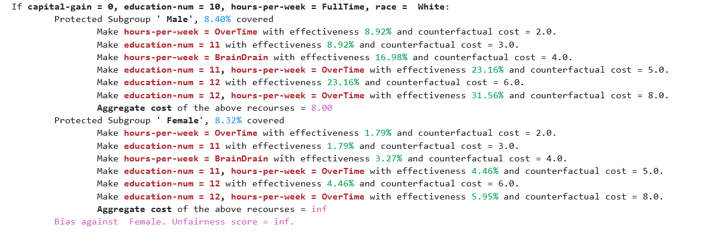

# Fairness Aware Counterfactuals for Subgroups

This repository is the implementation of the paper [Fairness Aware Counterfactuals for Subgroups (FACTS)](https://arxiv.org/abs/2306.14978). <br>
FACTS is a framework for auditing subgroup fairness through counterfactual explanations. We aim to (a) formulate different aspects of the difficulty of individuals in certain subgroups to achieve recourse, i.e. receive the desired outcome, either at the micro level, considering members of the subgroup individually, or at the macro level, considering the subgroup as a whole, and (b) introduce notions of subgroup fairness that are robust, if not totally oblivious, to the cost of achieving recourse. Below, appears a subgroup audited by one of our fairness metrics.  



In our work, we call the above representation "Comparative Subgroup Counterfactuals". These if-then rules, along with the effectiveness that each action manages to achieve (micro or micro, see Section 2.2 of our paper) give, in our opinion, a very clear and intuitive insight into certain type of bias that a machine learning model may exhibit.

## Structure
    .
    ├── examples                  # Folder containing example notebook
    │   ├── demo_FACTS.ipynb
    ├── src                     # Source code folder
    │   ├── clean.py             
    │   ├── formatting.py         
    │   ├── __init__.py        
    │   ├── frequent_itemsets.py               
    │   ├── misc.py               
    │   ├── optimization.py               
    │   ├── predicate.py               
    │   ├── parameters.py               
    │   ├── rule_filters.py               
    │   ├── utils.py               
    │   └── metrics.py           
    └── ...                     # README, requirements.txt, gitignore

## Requirements

FACTS uses python version 3.10.4. To avoid bugs due to incompatible package versions, we have exported the [txt file](requirements.txt) for the conda environment on which we worked.

To create a conda environment with the same configuration, run:

```setup
conda env create --name facts python==3.10.4
```

and then activate it with

```setup
conda activate facts
```

Install requirements:
```setup
pip install -r requirements.txt
```


